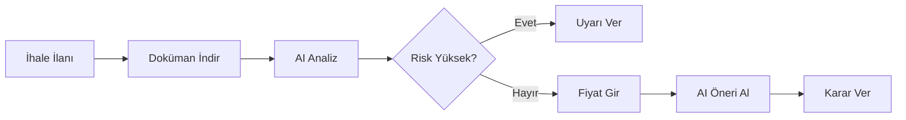

# 💼 TENDERAI – Yapay Zekâ Destekli Kamu İhale Karar Platformu

## 👤 Proje Sahibi
**AKPAYA Teknoloji Makine Hırdavat Bilgisayar İnşaat Sanayi ve Ticaret Ltd. Şti.**
**Kurucu:** Yakup Yaşar
**Proje:** TenderAI (Tender Artificial Intelligence)

---

## 🎯 Vizyonumuz
Türkiye'deki tüm kamu ihale süreçlerini (ilan, şartname, sözleşme, fiyatlandırma ve sonuç) derinlemesine analiz eden, tedarikçilere risksiz ve kârlı teklif stratejileri sunan, **pazar lideri Yapay Zekâ Destekli Karar Platformu** olmak.

## 🌍 Misyonumuz
Tedarikçilerin, saatler süren manuel şartname okuma, risk hesaplama ve geçmiş verileri analiz etme yükünü ortadan kaldırarak, **doğru ihaleye, doğru fiyattan, en yüksek kazanma ihtimaliyle** teklif vermelerini sağlamak.

**TenderAI, teklif hazırlama sürecini dakikalara indirecektir.**

---

## 🚀 Stratejik Hedefler

| Dönem | Hedef |
|-------|-------|
| **3 Ay** | ✅ MVP (Çalışan prototip) – EKAP veri entegrasyonu + AI analiz motoru |
| **6 Ay** | Yapay zekâ destekli şartname analizi ve risk puanlama sistemi |
| **9 Ay** | Fiyat karşılaştırma (geçmiş 3 yıl ihale sonuçlarıyla) |
| **12 Ay** | Ticari sürüm – SaaS abonelik modeliyle pazara açılış |

---

## ✅ Şu Anda Tamamlanan Özellikler (MVP v1.0)

### 🔍 1. İhale Veri Toplama
- ✅ EKAP sisteminden ihale ilanlarını otomatik çekme
- ✅ İhale dokümanlarını (PDF/DOC/DOCX) indirme ve saklama
- ✅ PostgreSQL veritabanında yapılandırılmış depolama

### 🧠 2. Gemini AI Analiz Motoru
- ✅ **İdari Şartname Analizi**: Katılım yeterlilikleri, teminat, belge gereklilikleri
- ✅ **Sözleşme Tasarısı Analizi**: Finansal riskler, ödeme vadeleri, cezai şartlar
- ✅ **Teknik Şartname Analizi**: Ürün/malzeme kalemleri, teknik gereklilikler
- ✅ **Risk Skorlama**: 0-10 arası risk skoru hesaplama (finansal, operasyonel, yasal)
- ✅ **BFTC Analizi**: Birim Fiyat Teklif Cetveli otomatik çıkarımı

### 💰 3. AI Tabanlı Fiyat Önerisi
- ✅ **Gemini 2.0 Flash** ile gerçek zamanlı fiyat stratejisi
- ✅ Risk bazlı fiyat optimizasyonu
- ✅ Kazanma olasılığı tahmini
- ✅ Kalem bazlı fiyatlandırma önerileri
- ✅ Stratejik uyarılar ve açıklamalar

### 📊 4. 9 Adımlı Analiz Wizard
1. **İhale Özeti**: Kurum, konu, yaklaşık maliyet
2. **İdari Şartname**: AI ile uygunluk analizi
3. **Sözleşme Tasarısı**: Finansal risk analizi
4. **Katılım Kararı**: Kullanıcı onayı
5. **Teknik Şartname**: Ürün eşleştirme
6. **Risk Değerlendirme**: Genel risk skoru
7. **BFTC Fiyat Girişi**: Interaktif fiyat tablosu
8. **AI Fiyat Önerisi**: Gemini AI ile gerçek öneri
9. **Sonuç Ekranı**: Nihai karar ve strateji

### 🔧 5. Teknik Altyapı
- ✅ **Backend**: ASP.NET Core 8.0 (Clean Architecture)
- ✅ **AI Integration**: Gemini 2.5 Flash & 2.0 Flash
- ✅ **Database**: PostgreSQL + Entity Framework Core
- ✅ **Document Processing**: NPOI (DOCX) + Multi-encoding (DOC)
- ✅ **Frontend**: Razor Pages + Bootstrap 5
- ✅ **Real-time**: JavaScript + localStorage caching

---

## 🎯 Gelecek Özellikler (Roadmap)

### 📈 Faz 2: Veri Ambarı ve Benchmark (3-6 Ay)
- [ ] **ElasticSearch Entegrasyonu**: Hızlı metin araması
- [ ] **Geçmiş İhale Sonuçları**: Son 3 yıl kazanan firma ve fiyat verileri
- [ ] **Piyasa Karşılaştırması**: Benzer ihalelerin ortalama fiyatları
- [ ] **Fiyat Trend Analizi**: Kalemlerin zaman içindeki fiyat değişimi

### 🤖 Faz 3: Gelişmiş AI Özellikleri (6-9 Ay)
- [ ] **TenderBot**: Şartname sorularına yanıt veren AI sohbet asistanı
- [ ] **Otomatik Belge Hazırlama**: İdari dosya oluşturma
- [ ] **Rakip Firma Analizi**: Geçmiş kazanan firmaların profilleri
- [ ] **Kur Riski Hesaplama**: Döviz volatilitesi entegrasyonu

### 📊 Faz 4: İş Zekası ve Raporlama (9-12 Ay)
- [ ] **TenderMap**: Türkiye geneli ihale yoğunluk haritası
- [ ] **Dashboard Analytics**: KPI'lar ve performans metrikleri
- [ ] **PDF Rapor Export**: Analiz sonuçlarını indirme
- [ ] **Email Bildirimleri**: Uygun ihaleler için otomatik uyarı

### 🌍 Faz 5: Genişleme (12+ Ay)
- [ ] **Mobil Uygulama**: TenderAI Mobile (iOS & Android)
- [ ] **API Market**: Diğer tedarikçiler için TenderAI API
- [ ] **AB İhale Entegrasyonu**: TED (Tenders Electronic Daily)
- [ ] **Multi-tenant SaaS**: Kurumsal abonelik modeli

---

## 🏗️ Teknik Mimari

```
┌─────────────────────────────────────────────────────────┐
│                    FRONTEND (Razor Pages)                │
│    Bootstrap 5 + JavaScript + LocalStorage Caching      │
└─────────────────────────────────────────────────────────┘
                            ↓
┌─────────────────────────────────────────────────────────┐
│              BACKEND (ASP.NET Core 8.0)                  │
│  Controllers → Services → Repositories → Database        │
└─────────────────────────────────────────────────────────┘
                            ↓
┌───────────────────┬─────────────────┬──────────────────┐
│   PostgreSQL DB   │  Gemini AI API  │  File Storage    │
│  (Entity + Data)  │  (2.5 & 2.0)    │  (PDF/DOC/DOCX)  │
└───────────────────┴─────────────────┴──────────────────┘
```

### Katmanlar (Clean Architecture)
1. **Domain**: Entities (Tender, DocumentAnalysis, TenderDocument)
2. **Infrastructure**: Services (AI, Document, EKAP), Data (EF Core)
3. **Core**: Interfaces, Business Logic
4. **Web**: Controllers, Views, wwwroot

---

## 📝 Kullanım Akışı



---

## 💡 Öne Çıkan Özellikler

### 🎯 Risk Skorlama Sistemi
- **Finansal Risk**: Ödeme vadesi + teminat + fiyat farkı
- **Operasyonel Risk**: Teslim süresi + montaj + eğitim
- **Yasal Risk**: Garanti + cezai şartlar + ihtar maddeleri

### 🤖 Gemini AI Entegrasyonu
- **Prompt Engineering**: Türkçe ihaleler için optimize edilmiş
- **Multi-model**: 2.5 Flash (analiz) + 2.0 Flash (öneri)
- **Structured Output**: JSON formatında güvenilir yanıtlar

### 📊 Gerçek Zamanlı Fiyat Önerisi
- BFTC verilerini analiz eder
- Risk skorlarını fiyata yansıtır
- Kazanma olasılığını tahmin eder
- Kalem bazlı öneriler sunar

---

## 🔐 Güvenlik ve Uyumluluk

- ✅ KVKK uyumlu veri işleme
- ✅ Şifreli veritabanı bağlantıları
- ✅ API key güvenliği (appsettings)
- ✅ Kullanıcı bazlı yetkilendirme (hazırlanıyor)

---

## 📞 İletişim

**Proje Sahibi:** Yakup Yaşar
**Şirket:** AKPAYA Teknoloji Ltd. Şti.
**Email:** [info@akpaya.com]
**Web:** [https://tenderai.app] (yakında)

---

## 📜 Lisans

Bu proje AKPAYA Teknoloji Ltd. Şti. tarafından geliştirilmiştir.
Tüm hakları saklıdır © 2025
